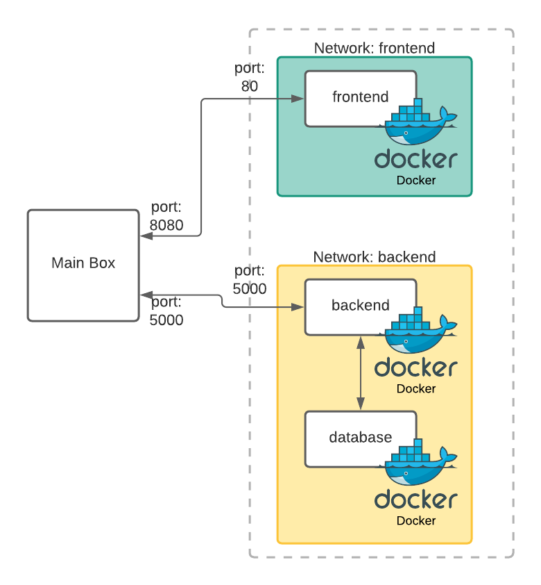

# docker-practice

The Goal for the next practice is to understand and build a basic system with a docker compose strucuture ... the system would be already be build your goals :

- generate the dockerfile to build the container.
- generate the docker-compose.yml to run the system.
- understand the network base and the logic behind the system itself 
- play and break stuff on your local env.


# The System 
This is a 3 image base system compose by 3 elements.

- vueproject (VueJs)
- flaskproject (Python api)
- database (mariadb)

As mention before the system is ready to be integrated no coding is needed for this example.

So This is what we are trying to build...



as shown in the picture we would have 2 networks one containing tha api and database and one containing only the frontend.


# Building The FrontEnd
The FrontEnd can be build using the script on the root folder 
```shell 
# the next line would create a tag name frontend:1.0
$ ./build_frontend.sh frontend:1.0
```

# Using the FrontEnd
To use the image that has been created by the script on your ```docker-compose.yml``` create a service called **frontend** and linke the **port 80 on the container to 8080 on your box**

# Using The Database
The Database folder contains an ```set_db.sql``` script that initialize the db with the next steps 

- create an **admin** user with the password **juiceBoxes** 
- assign all priviledge to that user
- create a database called **WORKSHOP**
- create a table called **images**
- insert rows into the table

For this on execution you can use a mysql or mariadb database just by mounting the sql file on the entrypoint directory would executed on initialization of the container.

On your ```docker-compose.yml``` create a service called **database** and s should contain something like the next code snippet with MYSQL_ROOT_PASSWORD been populated from the ```.env``` file

```yaml
services:
  #----------- MARIA DB ----------------
  database:
    image: mariadb:10.5.12
    environment:
      - MYSQL_ROOT_PASSWORD=${DB_ROOT_PASS}
    volumes: 
      - ./database/set_db.sql:/docker-entrypoint-initdb.d/script.sql

```

# Building the API
As mentioned before part of this workshop is to create a ```dockefile``` for the api itself you can see the instructions on the [flask-project](flask-project/ReadMe.md)

# Using The API
To use the api on your ```docker-compose.yml``` create a service called **backend** and add the next variables that are contained on the provided ```.env``` f

```yaml
- environment:  
    - FLASK_APP=${APP_NAME}
    - DB_USER=${DB_ADMIN}
    - DB_USER_PASS=${DB_ADMIN_PASS}
    - DB_HOST=${DB_HOST}
    - DB_NAME=${DB_NAME}
```
link the **port 5000 on the container to 5000 on your box**

> Note: the name of the services should be mapped correctly since the code is using those hostname to interconnect the 3 of them: **database, frontend, backend**

# Summary 
to summarise the goal is to create 2 files ```flask-project/dockerfile``` using the intructions on (flask-project/ReadMe.md) and ```docker-compose.yml``` using the instructions provided on this file for the 3 different services.

